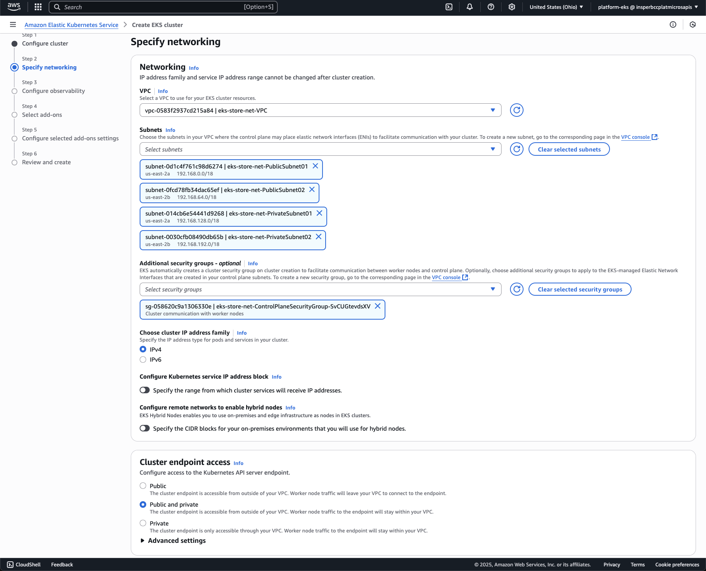

| Tarefas | Descrição | Peso |
|-|-|-:|
| AWS | Configurar AWS | 5% |
| EKS | Disponibilizar a aplicação | 15% |
| Testes | Testes de carga | 20% |
| CI/CD | Jenkins | 10% |
| Custos | Análise de custos | 15% |
| PaaS | Plano de uso da plataforma | 15% |
| Apresentação | Storytelling | 20% |


## Configuração do AWS

A AWS é uma plataforma de computação em nuvem que oferece uma ampla gama de serviços, incluindo computação, armazenamento, banco de dados, análise, rede, mobilidade, ferramentas de desenvolvedor, gerenciamento e segurança. Para configurar a AWS, você precisará criar uma conta e configurar os serviços necessários para o seu projeto.


??? tip "Roadmap"

    **This roudmap is not complete and may not cover all the steps you need to take to configure your AWS environment. It is a good start to help you understand the steps you need to take to configure your AWS environment. You can find more information about each step in the AWS documentation.**

    Create an AWS account and configure the AWS CLI. You can use the AWS CLI to manage your AWS services from the command line.
    
    === "1. Create User"

        { width=100% }
        { width=100% }
        { width=100% }

    === "2. Loggin at AWS Dashboard"

        Loggin at the AWS Dashboard with the created user.

    === "3. Create Access Key"

        { width=100% }
        { width=100% }
        { width=100% }

    === "4. Configure AWS CLI"

        [AWS CLI](https://docs.aws.amazon.com/cli/latest/userguide/getting-started-install.html){target="_blank"}


## Configuração do EKS

O Amazon Elastic Kubernetes Service (EKS) é um serviço gerenciado que facilita a execução do Kubernetes na AWS sem a necessidade de instalar e operar seu próprio plano de controle ou nós de trabalho do Kubernetes. O EKS cuida da alta disponibilidade e escalabilidade do plano de controle do Kubernetes, permitindo que você se concentre em implantar e gerenciar seus aplicativos.

- [EKS](https://docs.aws.amazon.com/eks/latest/userguide/getting-started.html){target="_blank"}

!!! danger "Custo de Uso"

    O custo de uso do EKS pode variar dependendo da região e dos serviços utilizados. É importante monitorar os custos e otimizar o uso dos recursos para evitar surpresas na fatura. Você pode usar a calculadora de preços da AWS para estimar os custos do seu projeto.

    **CUIDADO**: o tipo de instância EC2 é um dos principais fatores que afetam o custo do EKS. Instâncias maiores e mais poderosas custam mais, enquanto instâncias menores e menos poderosas custam menos. Além disso, o uso de recursos adicionais, como armazenamento em bloco e balanceadores de carga, também pode aumentar os custos[^1].


!!! info "TO DO"

    Faça um cluster EKS e faça o deploy da aplicação Spring Boot no cluster. Você pode usar o AWS CLI ou o console da AWS para criar e gerenciar seu cluster EKS.

    Para implementar a base de dados, você pode usar o Amazon RDS (Relational Database Service) ou o Amazon DynamoDB, dependendo das necessidades do seu projeto. 

??? tip "Roadmap"

    **This roudmap is not complete and may not cover all the steps you need to take to configure your AWS environment. It is a good start to help you understand the steps you need to take to configure your AWS environment. You can find more information about each step in the AWS documentation.**

    Create an AWS account and configure the AWS CLI. You can use the AWS CLI to manage your AWS services from the command line.
    
    === "1. Create EKS Role"

        { width=100% }
        { width=100% }
        { width=100% }

    === "2. Create a VPC"

        Overview of the VPC:

        ``` mermaid
        flowchart TB
        subgraph Region
            direction LR
            subgraph Zone A
            direction LR
            subgraph subpri1["Subnet Private"]
                direction TB
                poda1["pod 1"]
                poda2["pod 2"]
                poda3["pod 3"]
            end
            subgraph subpub1["Subnet Public"]
                loadbalancea["Load Balance"]
            end
            end
            subgraph Zone B
            direction LR
            subgraph subpri2["Subnet Private"]
                direction TB
                podb1["pod 1"]
                podb2["pod 2"]
                podb3["pod 3"]
            end
            subgraph subpub2["Subnet Public"]
                loadbalanceb["Load Balance"]
            end
            end
            User --> loadbalancea
            loadbalancea --> poda1
            loadbalancea --> poda2
            loadbalancea --> poda3
            User --> loadbalanceb
            loadbalanceb --> podb1
            loadbalanceb --> podb2
            loadbalanceb --> podb3
        end
        ```

        Create a VPC with the following configuration, including 2 public and 2 private subnets. The public subnets will be used for the load balancers, and the private subnets will be used for the pods. The VPC should be created in the same region as the EKS cluster.

        To create the VPC, use the AWS CloudFormation with the template file: [amazon-eks-vpc-private-subnets.yaml](../../assets/templates/amazon-eks-vpc-private-subnets.yaml) (download it and upload it as a CloudFormation template).

        { width=100% }
        { width=100% }
        { width=100% }


    === "3. Create EKS Cluster"

        { width=100% }
        { width=100% }
        { width=100% }

        !!! warning "Pay Attention"
    
            The EKS cluster will take a few minutes to be created. You can check the status of the cluster in the AWS console. Once the cluster is created, you can access it using the AWS CLI or kubectl.
        
            Notice that there no nodes on cluster also, because only the Control Pane had been created, there is no exist a node for the worker nodes.

    === "4. Create a Role for the Node Group"

        { width=100% }

        ---

        Add Permissions to the role:

        - AmazonEKS_CNI_Policy
        - AmazonEKSWorkerNodePolicy
        - AmazonEC2ContainerRegistryReadOnly

        ---

        { width=100% }
        { width=100% }


    === "5. Define the Node Group"

        { width=100% }
        { width=100% }

        **Define the Configuration of machine type**

        { width=100% }

        Only private subnets:

        { width=100% }


    === "6. Access the EKS Cluster"

        [AWS CLI](https://docs.aws.amazon.com/cli/latest/userguide/getting-started-install.html){target="_blank"}

        On terminal, after that it had been set up the aws cli.

        ``` shell
        aws configure
        ```

        See the configuration that was set up:

        ``` shell
        aws configure list
        ```
        <!-- termynal -->
        ``` shell
        > aws configure list
            Name                    Value             Type    Location
            ----                    -----             ----    --------
        profile                <not set>             None    None
        access_key     ****************TTNI shared-credentials-file    
        secret_key     ****************zAJ1 shared-credentials-file    
            region                us-east-2      config-file    ~/.aws/config
        ```

        Set up the kube-config to point to the remote aws eks cluster.

        ``` shell
        aws eks update-kubeconfig --name eks-store
        ```
        <!-- termynal -->
        ``` shell
        > aws eks update-kubeconfig --name eks-store
        Added new context arn:aws:eks:us-east-2:058264361068:cluster/eks-store to /Users/sandmann/.kube/config
        >
        >
        > kubectl get pods
        No resources found in default namespace.
        >
        >
        > kubectl get nodes
        No resources found
        >
        ```        

        !!! tip "Nice commands"

        ``` bash
        kubectl config get-contexts
        ```

        ``` bash
        kubectl config set-context [NAME]
        ```


## Testes de Carga

Os testes de carga são uma parte importante do desenvolvimento de software, pois ajudam a garantir que sua aplicação possa lidar com o tráfego esperado. Existem várias ferramentas disponíveis para realizar testes de carga, incluindo Apache JMeter, Gatling e Locust.

[Kubernetes - HPA - Increase the load](https://kubernetes.io/docs/tasks/run-application/horizontal-pod-autoscale-walkthrough/#increase-load){target="_blank"}

!!! info "TO DO"

    Faça um teste de carga na sua aplicação Spring Boot. Grave um video do teste de carga, mostrando:
    - O teste de carga em execução;
    - HPA (Horizontal Pod Autoscaler) em execução;
    

## CI/CD

A integração contínua (CI) e a entrega contínua (CD) são práticas de desenvolvimento de software que ajudam a garantir que seu código esteja sempre em um estado implantável. O Jenkins é uma ferramenta popular para implementar CI/CD em seus projetos.

!!! info "TO DO"

    Complemente seu pipeline de CI/CD de forma que após o push da imagem no Docker Hub, o Jenkins faça o deploy da imagem no EKS.

## Custos

A análise de custos é uma parte importante do desenvolvimento de software, pois ajuda a garantir que seu projeto esteja dentro do orçamento. Existem várias ferramentas disponíveis para ajudar na análise de custos, incluindo o AWS Cost Explorer[^2] e o AWS Budgets[^3].

!!! info "TO DO"

    Monte um plano de custos para o seu projeto, incluindo os custos de uso do EKS, RDS e outros serviços da AWS que você está utilizando. Use a calculadora de preços da AWS para estimar os custos do seu projeto.


## PaaS

A plataforma como serviço (PaaS) é um modelo de computação em nuvem que fornece uma plataforma para desenvolver, executar e gerenciar aplicativos sem a complexidade de construir e manter a infraestrutura normalmente associada ao desenvolvimento e lançamento de aplicativos.

{ width=100% }

!!! info "TO DO"

    Descreva onde seu grupo utilizou PaaS e como utilizou.


## Apresentação

A apresentação do seu projeto é uma parte importante do processo de desenvolvimento de software. É a oportunidade de mostrar seu trabalho e explicar como sua aplicação funciona. Use ferramentas como o PowerPoint ou o Google Slides para criar uma apresentação visualmente atraente. Se possível, faça uma demonstração ao vivo da sua aplicação para mostrar como ela funciona na prática, assim bem como um vídeo de apresentação do projeto.

!!! info "TO DO"

    Crie uma apresentação do seu projeto, incluindo os seguintes tópicos:

    - Introdução ao projeto;
    - Arquitetura do projeto;
    - Demonstração da aplicação;
    - Desafios enfrentados - bottlenecks;
    - Conclusão e próximos passos.

    O vídeo de apresentação deve ter entre 2 e 3 minutos e deve ser enviado junto com a documentação do projeto.

!!! tip "Video de Apresentação"

    Excepcionalmente, nesta edição do curso, a apresentação do projeto será feita através de um vídeo de 3 a 5 minutos, onde cada grupo deve apresentar o projeto e os bottlenecks implementados. O vídeo deve ser enviado junto com a documentação do projeto.

!!! danger "Entrega"

    Individualmente, cada aluno deve criar um repositório no GitHub, com a documentação em MkDocs dos exercícios realizados e também com o projeto e entrega o link via BlabkBoard. Na documentação publicada deve constar:

    - Nome do aluno e grupo;
    - Documentação das atividades realizadas;
    - Código fonte das atividades realizadas;
    - Documentação do projeto;
    - Código fonte do projeto;
    - Link para todos os repositórios utilizados;
    - Destaques para os bottlenecks implementados (ao menos 2 por indivíduo);
    - Apresentação do projeto;
    - Vídeo de apresentação do projeto (2-3 minutos);
    
    Um template de documentação pode ser encontrado em [Template de Documentação](https://hsandmann.github.io/documentation.template/){target="_blank"}.

[^1]: [AWS Pricing Calculator](https://calculator.aws/#/){target="_blank"}
[^2]: [AWS Cost Explorer](https://aws.amazon.com/aws-cost-management/aws-cost-explorer/){target="_blank"}
[^3]: [AWS Budgets](https://aws.amazon.com/aws-cost-management/aws-budgets/){target="_blank"}
