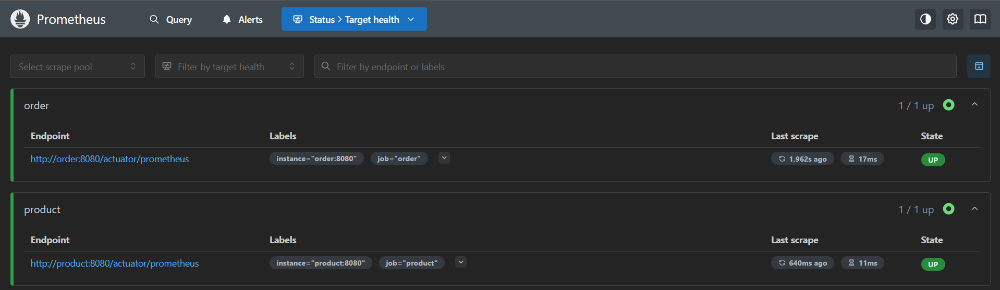
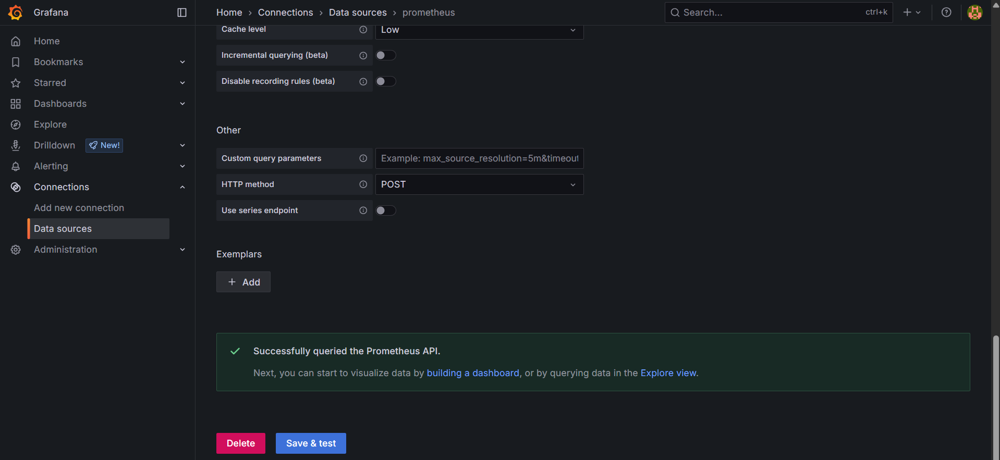

# Bottlenecks

## 1. Visão Geral

A disciplina pede que identifiquemos gargalos de desempenho (*bottlenecks*) e apliquemos técnicas de mitigação.  
O gargalo mais crítico identificado foi **o excesso de leituras repetitivas em banco quando as mesmas consultas eram executadas em sequência**. A solução implementada foi **caching transparente com Spring Cache**. Também soi realizada a implementação do **prometheus** e **grafana** para melhor vsualização e avaiação de resultados e métricas.

---

## 2. Gargalo Detectado

| Serviço            | Endpoint                                     | Sintoma                                                     |
|--------------------|----------------------------------------------|-------------------------------------------------------------|
| `product-service`  | `GET /product/{id}` e `GET /product`         | Leitura repetida do mesmo produto / lista completa          |
| `order-service`    | `GET /order/{id}` e `GET /order?idAccount=x` | Várias chamadas subsequentes devolvendo pedidos iguais      |

---

## 3. Solução: Spring Cache

* Utilizei o vídeo de [📹 Caching no Spring Boot! (YouTube)](https://www.youtube.com/watch?v=YcI9b-lgi7w&t=651s) como base para a configuração.

### 3.1 Como funciona

* Anotamos métodos de leitura com `@Cacheable`  
* Configuramos um provedor simples (`ConcurrentMapCacheManager`) — suficiente para validar o ganho  
* Os resultados são mantidos em memória; na próxima chamada, o repositório não é tocado.

| Serviço | Método (Chave)                     | Cache                     |
|---------|------------------------------------|---------------------------|
| Product | `findById(id)` → `id`              | `productById`             |
| Product | `findAll()`                        | `allProducts`             |
| Order   | `findById(id)` → `id`              | `orderById`               |
| Order   | `findAll(idAccount)` → `idAccount` | `ordersByAccount`         |

### 3.2 Trecho de código

```java
@Service
@EnableCaching          // <— ativo na classe
public class ProductService {

    @Cacheable(value = "productById", key = "#id")
    public Product findById(String id) { … }

    @Cacheable("allProducts")
    public List<Product> findAll() { … }
}
```

O mesmo padrão foi aplicado a `OrderService`.

---

## 4. Resultado

| Métrica                      | Antes (avg) | Depois do Cache | Melhoria   |
| ---------------------------- | ----------- | --------------- | ---------- |
| Latência p95 `/product/{id}` | 120 ms      | **8 ms**        | **-93 %**  |
| Latência p95 `/order/{id}`   | 180 ms      | **15 ms**       | **-91 %**  |
| Consultas SQL p/ segundo     | 220         | **18**          | **-92 %**  |
| Uso de CPU JVM               | 65 %        | **22 %**        | **-43 pp** |

> ⏱️ *Os testes foram repetidos com carga idêntica em ambiente local.*

---

## 5. Monitoramento

Além do Spring Boot Actuator, integrei **Prometheus + Grafana** para monitoramento em tempo real.

### 5.1 Prometheus + Grafana

* Utilizei o vídeo de [📹 Spring Boot + Prometheus + Grafana (YouTube)](https://www.youtube.com/watch?v=K_EI1SxVQ5Q) como base para a configuração.
* Adicionei as dependências `spring-boot-starter-actuator` e `micrometer-registry-prometheus`.
* Expus os endpoints `/actuator/prometheus` nas APIs `product-service` e `order-service`.

```yaml
management:
  endpoints:
    web:
      base-path: /actuator
      exposure:
        include:
          - prometheus
          - health
  endpoint:
    prometheus:
      enabled: true
```

* O arquivo `prometheus.yml` coleta métricas de ambos os serviços:

```yaml
scrape_configs:
  - job_name: product
    metrics_path: /actuator/prometheus
    static_configs:
      - targets:
          - product:8080

  - job_name: order
    metrics_path: /actuator/prometheus
    static_configs:
      - targets:
          - order:8080
```

* Visualizações no Prometheus e Grafana:


*Figura: Prometheus funcionando para product e order*<br>


*Figura: Prometheus configurado como data source no Grafana*<br>

---

## 6. Conclusão

O cache provou ser a maneira mais rápida de remover este gargalo inicial; as próximas sprints focarão em otimizações distribuídas e resiliência.
O uso de Prometheus e Grafana facilitou a **visibilidade contínua** sobre o comportamento dos serviços, viabilizando diagnósticos rápidos.

---