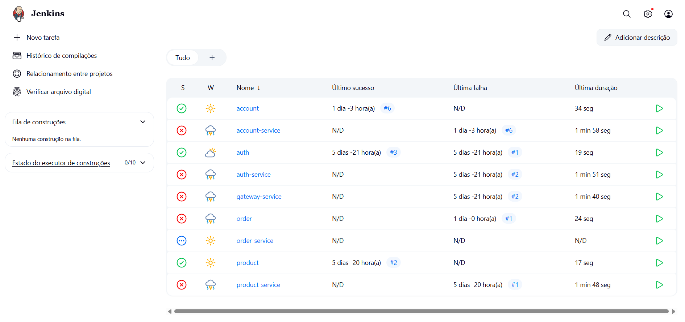

# Jenkins

> *Automatizando builds e integrações no projeto Plataforma de Microsserviços*

---

## 1. Visão Geral

Nesta etapa do projeto, a proposta era **configurar pipelines com Jenkins**, integrando os repositórios de cada microsserviço à automação de build e publicação de imagens Docker.

Mesmo sem finalizar a configuração completa de todos os jobs (como evidenciado nos estados de falha), foi possível compreender a estrutura necessária e aplicar a lógica básica em vários dos serviços.

---

## 2. Interface Jenkins

A seguir, temos a visão geral da interface do Jenkins com os jobs configurados:

📷 **Imagem 1 – Dashboard do Jenkins**


Cada serviço (interface ou service) foi adicionado como um pipeline separado.

---

## 3. Credencial Docker Hub

Para permitir o **push automático de imagens Docker**, foi configurada uma credencial do tipo *Username + Password* com o ID `dockerhub-credential`, conforme a imagem abaixo:

📷 **Imagem 2 – Credential configurada**


---

## 4. Jenkinsfile – Interfaces

As interfaces (como `product`, `order`, `account`) utilizam um Jenkinsfile simples para build Maven:

```groovy
pipeline {
    agent any

    stages {
        stage('Build') {
            steps {
                sh 'mvn -B -DskipTests clean install'
            }
        }
    }
}
```

Este pipeline **compila o código** e garante que as dependências estejam corretas, mas não realiza deploy de imagens.

---

## 5. Jenkinsfile – Services

Para os services (como `order-service`, `product-service`, etc.), o Jenkinsfile realiza também o build da imagem Docker e seu push para o Docker Hub:

```groovy
pipeline {
    agent any
    environment {
        SERVICE = 'order-service'
        NAME = "ribollequis87/${env.SERVICE}"
    }
    stages {
        stage('Dependecies') {
            steps {
                build job: 'order', wait: true
                build job: 'product', wait: true
            }
        }
        stage('Build') { 
            steps {
                sh 'mvn -B -DskipTests clean package'
            }
        }      
        stage('Build & Push Image') {
            steps {
                withCredentials([usernamePassword(credentialsId: 'dockerhub-credential', usernameVariable: 'USERNAME', passwordVariable: 'TOKEN')]) {
                    sh "docker login -u $USERNAME -p $TOKEN"
                    sh "docker buildx create --use --platform=linux/arm64,linux/amd64 --node multi-platform-builder-${env.SERVICE} --name multi-platform-builder-${env.SERVICE}"
                    sh "docker buildx build --platform=linux/arm64,linux/amd64 --push --tag ${env.NAME}:latest --tag ${env.NAME}:${env.BUILD_ID} -f Dockerfile ."
                    sh "docker buildx rm --force multi-platform-builder-${env.SERVICE}"
                }
            }
        }
    }
}
```

Esse pipeline **compila, empacota, constrói e publica a imagem** usando multi-platform Docker build.

---

## 6. Conclusão

Mesmo com algumas falhas nos pipelines, o processo de integração contínua via Jenkins foi iniciado corretamente. As principais configurações de credenciais e automações foram implementadas com sucesso, permitindo futuramente uma integração completa CI/CD entre os microsserviços da plataforma.