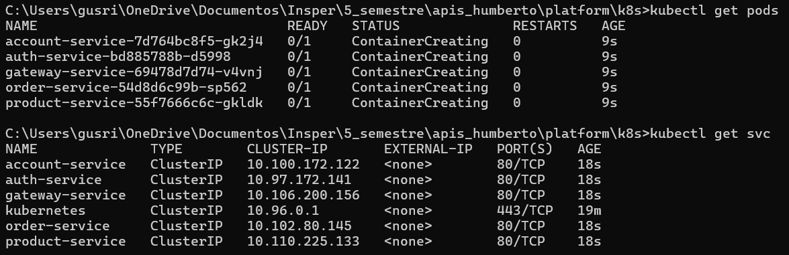

# MiniKube

> Parte do [Checkpoint 5](https://insper.github.io/platform/checkpoints/5/checkpoint/#minikube)

---

## Objetivo

Executar todos os serviços da plataforma localmente em um cluster Kubernetes com o **Minikube**, simulando um ambiente de orquestração completo.

---

## Pré-Requisitos

* Docker instalado e rodando
* [Minikube instalado](https://minikube.sigs.k8s.io/docs/start/)
* [kubectl instalado](https://kubernetes.io/docs/tasks/tools/)

---

## Passos para Rodar

### 1. Iniciar o Minikube

No terminal, rode:

```bash
minikube start --driver=docker
```

> Isso cria um cluster Kubernetes local usando Docker como driver.

---

### 2. Clonar e navegar até o projeto

```bash
cd platform/k8s
```

Esse diretório contém os arquivos YAML de `deployment` e `service` gerados para:

* `account-service`
* `auth-service`
* `exchange-service`
* `gateway-service`
* `order-service`
* `product-service`

---

### 3. Aplicar todos os arquivos

```bash
kubectl apply -f .
```

> Esse comando lê todos os arquivos `.yml` do diretório atual e sobe os pods e serviços no cluster.

---

### 4. Verificar status

#### Pods

```bash
kubectl get pods
```

#### Serviços

```bash
kubectl get svc
```

#### Retorno Esperado:



---

## Acessando a aplicação

Se quiser acessar algum serviço (ex: `gateway-service`) localmente via browser:

```bash
minikube service gateway-service
```

Isso abre automaticamente o serviço no navegador com um **túnel temporário** via Minikube.

---

## Arquitetura do `k8s/`

```
k8s/
├─ account-deployment.yml
├─ account-service.yml
├─ auth-deployment.yml
├─ auth-service.yml
├─ ...
└─ product-service.yml
```

Cada serviço possui dois arquivos:

| Tipo       | Descrição                          |
| ---------- | ---------------------------------- |
| Deployment | Define quantas réplicas, imagem... |
| Service    | Expõe a porta do pod no cluster    |

---
